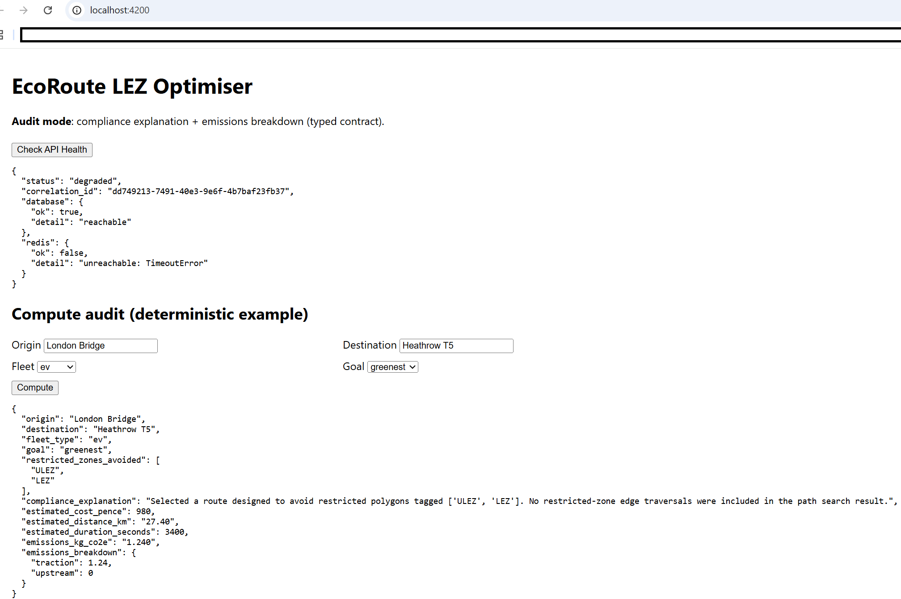
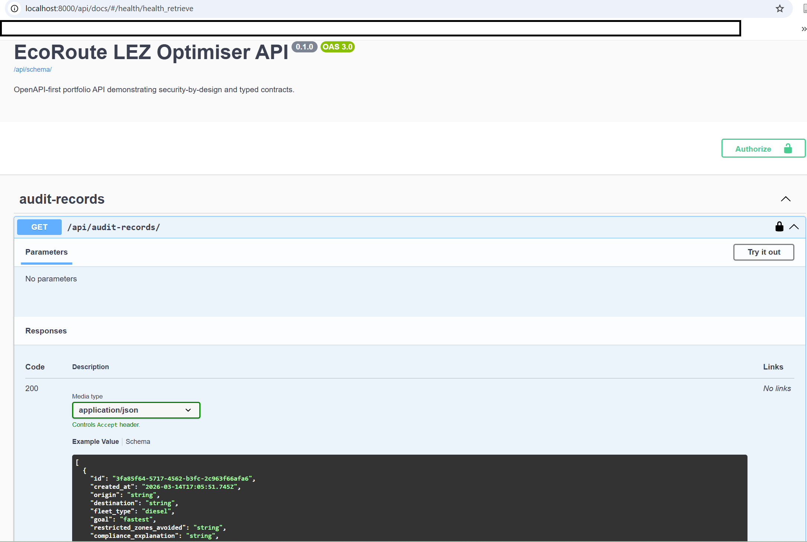
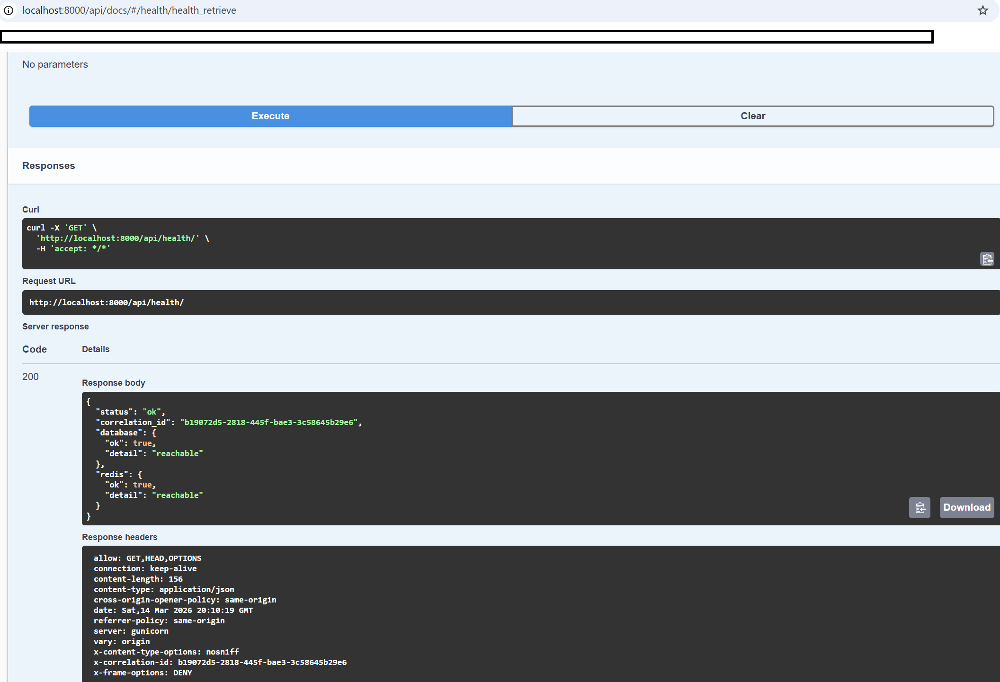
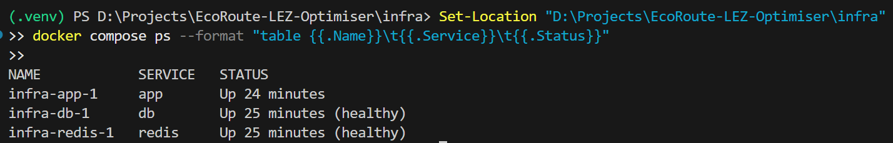
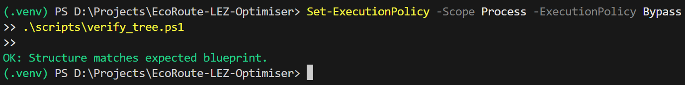
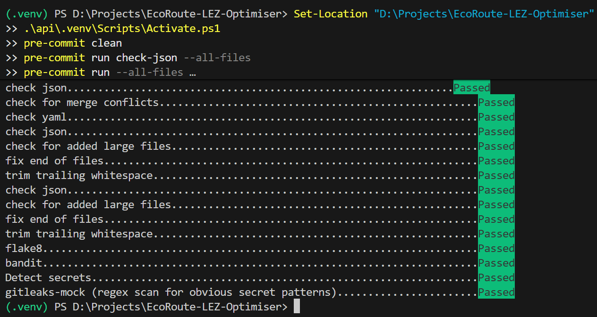

# EcoRoute LEZ Optimiser — Cost + Carbon Routing for London Constraints

**Educational Purpose & Skills Showcase**: This repository is a portfolio-grade demonstration of security-by-design engineering, OpenAPI-first contracts, enterprise type safety, Dockerized local development, and AI governance patterns. It is not a production transport advisory system and must not be used for real-world compliance decisions.

## Overview

EcoRoute LEZ Optimiser is a Django + Angular portfolio project focused on secure-by-default implementation, typed contracts, and reproducible local execution. It demonstrates a route-audit workflow for London-style LEZ/ULEZ constraints with deterministic outputs for compliance explanation, emissions breakdown, cost, time, and distance.

The project is intentionally structured around strict file naming and contract alignment. In particular, the Angular frontend uses these exact files:

- `client/src/app/app.ts`
- `client/src/app/services/api.ts`

The following filenames are intentionally **not** used:

- `app.component.ts`
- `api.service.ts`

## Why This Project Matters

This repository is designed to demonstrate engineering patterns that are highly relevant to modern backend, frontend, and platform-oriented delivery:

- secure-by-default Django API design
- OpenAPI-first contract visibility
- strict Angular and TypeScript alignment with backend response shapes
- deterministic, inspectable route-audit behavior
- Dockerized local reproducibility
- governance-aware repository design
- enterprise-style quality controls such as linting, secret scanning, dependency scanning, and structural verification

## What It Does

- Computes deterministic audit responses for a route between an origin and destination
- Models fleet types such as diesel, hybrid, and EV
- Returns a compliance explanation describing avoided restricted zones
- Returns emissions, cost, distance, and duration values
- Exposes OpenAPI schema and Swagger UI for the backend API
- Demonstrates typed frontend/backend contract alignment
- Demonstrates correlation ID propagation, secret scanning, dependency scanning, linting, and structural verification
- Includes AI governance artifacts for prompt governance and evaluation control, even though the application does not require an LLM to operate

## Main Capabilities

### Backend API

The backend provides:

- `GET /api/health/`
- `GET /api/schema/`
- `GET /api/docs/`
- `GET /api/audit-records/`
- `POST /api/audit-records/create/`
- `POST /api/audit/compute/`

### Frontend UI

The Angular frontend provides:

- API health check button
- Deterministic compute request form
- Typed display of returned JSON
- Correlation ID propagation on outbound requests

### Security and Governance

The repository includes:

- Correlation ID middleware
- OpenAPI-first schema generation
- `pre-commit` hooks
- `detect-secrets` baseline
- `gitleaks` and mock gitleaks scan
- `flake8`
- `bandit`
- `pip-audit`
- `safety`
- AI governance policy
- Prompt catalog
- Sample evaluation JSON

## Technology Stack

### Backend

- Python
- Django
- Django REST Framework
- `drf-spectacular`
- `django-cors-headers`
- Gunicorn
- WhiteNoise
- `dj-database-url`
- `python-dotenv`
- Redis client
- PostgreSQL/PostGIS support via `psycopg[binary]`

### Frontend

- Angular
- TypeScript
- RxJS
- Angular standalone components
- Angular strict mode
- ESLint

### Infrastructure

- Docker
- Docker Compose
- PostgreSQL/PostGIS
- Redis

## Repository Structure

```text
EcoRoute-LEZ-Optimiser/
├─ .gitignore
├─ .pre-commit-config.yaml
├─ README.md
├─ LICENSE
├─ .secrets.baseline
├─ screenshots/
│  ├─ angular-home-health-compute.png
│  ├─ api-docs-swagger.png
│  ├─ api-health-json.png
│  ├─ docker-compose-running.png
│  ├─ verify-tree-passing.png
│  └─ pre-commit-passing.png
├─ ai_governance/
│  ├─ policy.md
│  ├─ prompt_catalog.json
│  └─ evaluations/
│     └─ sample_eval.json
├─ api/
│  ├─ .env.example
│  ├─ .flake8
│  ├─ gunicorn_conf.py
│  ├─ manage.py
│  ├─ requirements.txt
│  ├─ ecoroute_api/
│  │  ├─ __init__.py
│  │  ├─ asgi.py
│  │  ├─ middleware.py
│  │  ├─ settings.py
│  │  ├─ urls.py
│  │  └─ wsgi.py
│  └─ core/
│     ├─ __init__.py
│     ├─ admin.py
│     ├─ apps.py
│     ├─ models.py
│     ├─ serializers.py
│     ├─ tests.py
│     ├─ urls.py
│     ├─ views.py
│     └─ migrations/
├─ client/
│  ├─ .editorconfig
│  ├─ .eslintignore
│  ├─ .eslintrc.json
│  ├─ angular.json
│  ├─ package.json
│  ├─ tsconfig.json
│  ├─ tsconfig.app.json
│  ├─ tsconfig.spec.json
│  └─ src/
│     ├─ index.html
│     ├─ main.ts
│     ├─ styles.css
│     ├─ environments/
│     │  ├─ environment.development.ts
│     │  └─ environment.ts
│     └─ app/
│        ├─ app.ts
│        ├─ app.config.ts
│        ├─ app.routes.ts
│        ├─ models/
│        │  └─ route-audit.model.ts
│        └─ services/
│           └─ api.ts
├─ docs/
│  └─ adr/
│     └─ 0001-security-by-design-and-openapi-first.md
├─ infra/
│  ├─ Dockerfile
│  └─ docker-compose.yml
└─ scripts/
   ├─ mock_gitleaks.py
   └─ verify_tree.ps1
````

## Screenshots

### Angular App — Health + Compute



### Swagger UI



### Health Endpoint JSON



### Docker Compose Running



### Structure Verification



### Pre-commit Passing



## Quick Start

Use either the local development workflow or the Docker workflow.

### Local backend

```powershell
cd .\api
py -m venv .venv
.\.venv\Scripts\Activate.ps1
py -m pip install --upgrade pip setuptools wheel
py -m pip install -r .\requirements.txt
py manage.py makemigrations
py manage.py migrate
py manage.py runserver 0.0.0.0:8000
```

Backend endpoints:

* `http://localhost:8000/api/health/`
* `http://localhost:8000/api/schema/`
* `http://localhost:8000/api/docs/`

### Local frontend

```powershell
cd .\client
npm install
ng serve --open
```

Frontend:

* `http://localhost:4200`

### Docker workflow

```powershell
cd .\infra
docker compose up --build
```

To stop containers:

```powershell
docker compose down
```

If a terminal command hangs or needs to be stopped, press:

```text
CTRL + C
```

## API Endpoints

### Health Check

```http
GET /api/health/
```

Returns application health status, correlation ID, and dependency checks for database and Redis.

### OpenAPI Schema

```http
GET /api/schema/
```

Returns the generated OpenAPI schema.

### Swagger UI

```http
GET /api/docs/
```

Serves interactive API documentation.

### List Audit Records

```http
GET /api/audit-records/
```

Returns saved route audit records ordered by newest first.

### Create Audit Record

```http
POST /api/audit-records/create/
Content-Type: application/json
```

Creates a persisted route audit record.

### Deterministic Audit Compute

```http
POST /api/audit/compute/
Content-Type: application/json
```

Returns a deterministic audit response for the supplied route and optimisation inputs.

#### Example Request

```json
{
  "origin": "London Bridge",
  "destination": "Heathrow T5",
  "fleet_type": "ev",
  "goal": "greenest"
}
```

#### Example Response

```json
{
  "origin": "London Bridge",
  "destination": "Heathrow T5",
  "fleet_type": "ev",
  "goal": "greenest",
  "restricted_zones_avoided": ["ULEZ", "LEZ"],
  "compliance_explanation": "Selected a route designed to avoid restricted polygons tagged ['ULEZ', 'LEZ']. No restricted-zone edge traversals were included in the path search result.",
  "estimated_cost_pence": 980,
  "estimated_distance_km": "27.40",
  "estimated_duration_seconds": 3400,
  "emissions_kg_co2e": "1.240",
  "emissions_breakdown": {
    "traction": 1.24,
    "upstream": 0.0
  }
}
```

## Contract Design

The project mirrors backend contracts into frontend TypeScript models.

### Backend Serializer

* `api/core/serializers.py`

### Frontend Typed Model

* `client/src/app/models/route-audit.model.ts`

### Frontend API Service

* `client/src/app/services/api.ts`

This reduces drift between backend response shapes and frontend consumption.

## Security-by-Design

This repository is designed to demonstrate secure defaults from day zero.

### OpenAPI-First Contracts

* API schema is generated using `drf-spectacular`
* Typed clients can be kept aligned with explicit contracts
* Changes to the contract surface are visible and reviewable

### Correlation ID Tracing

* Requests may include `X-Correlation-ID`
* Middleware normalises inbound values to valid UUIDs
* Invalid inbound values are discarded and replaced
* Correlation IDs are propagated to responses and logs

### Secret Prevention

* `pre-commit` hooks run before commit
* `detect-secrets` baseline is stored in the repository
* `gitleaks` hook is configured
* `scripts/mock_gitleaks.py` provides a deterministic fallback demo scanner

### Dependency Scanning

Python dependency checks include:

* `pip-audit`
* `safety`

### Static Analysis

Python code quality checks include:

* `flake8`
* `bandit`

Frontend quality checks include:

* ESLint with TypeScript support

## AI Governance

This repository includes an `ai_governance/` folder to demonstrate enterprise governance patterns even when AI is optional.

### Included Governance Artifacts

* `ai_governance/policy.md`
* `ai_governance/prompt_catalog.json`
* `ai_governance/evaluations/sample_eval.json`

### Governance Principles

* No production secrets in prompts, examples, or evaluation artifacts
* No personal data processing without explicit review
* Human-in-the-loop review for compliance-relevant narrative outputs
* Deterministic evaluation artifacts where feasible
* Prohibition of fabricated claims and unverifiable outputs

## Local Development

### Prerequisites

* Python 3.12 or a compatible Python 3.x installation accessible with `py`
* Node.js 20 or a compatible LTS release
* npm
* Angular CLI
* Docker Desktop
* Git
* PowerShell on Windows

### Backend Setup

```powershell
cd .\api
py -m venv .venv
.\.venv\Scripts\Activate.ps1
py -m pip install --upgrade pip setuptools wheel
py -m pip install -r .\requirements.txt
py manage.py makemigrations
py manage.py migrate
py manage.py runserver 0.0.0.0:8000
```

Backend should be available at:

* `http://localhost:8000/api/health/`
* `http://localhost:8000/api/schema/`
* `http://localhost:8000/api/docs/`

### Frontend Setup

```powershell
cd .\client
npm install
ng serve --open
```

Frontend should be available at:

* `http://localhost:4200`

### Important Frontend/Backend Integration Notes

* CORS support must be enabled in Django for `http://localhost:4200`
* `CommonModule` must be imported in `client/src/app/app.ts`
* `FormsModule` must be imported in `client/src/app/app.ts`
* The frontend service file must remain `client/src/app/services/api.ts`
* The frontend component file must remain `client/src/app/app.ts`

### Health Endpoint Note

Before Redis is running, the local health endpoint may legitimately return:

```json
{
  "status": "degraded"
}
```

That is acceptable in local development mode.

## Quality Gates

### Python Quality Checks

```powershell
cd .\api
.\.venv\Scripts\Activate.ps1
py -m flake8 .
py -m bandit -r . -q
py -m pip_audit -r requirements.txt
safety check -r requirements.txt
```

### Frontend Lint

```powershell
cd .\client
npm install
npm run lint
```

### Pre-commit Setup

```powershell
.\api\.venv\Scripts\Activate.ps1
pre-commit install
pre-commit run --all-files
```

### Structure Verification

```powershell
powershell -ExecutionPolicy Bypass -File .\scripts\verify_tree.ps1
```

Expected result:

```text
OK: Structure matches expected blueprint.
```

## Docker

### Start the Stack

```powershell
cd .\infra
docker compose up --build
```

This starts:

* `db`
* `redis`
* `app`

### Apply Migrations Inside Docker

```powershell
cd .\infra
docker compose exec app python manage.py migrate
```

This step is mandatory. Without it, the containerized database schema is not initialized.

### Test the Dockerized Application

```powershell
curl http://localhost:8000/api/health/
Start-Process "http://localhost:8000/api/docs/"
```

When database and Redis are healthy, the health endpoint should report fully healthy status.

## Verification Checklist

A project state is considered complete only when all of the following are true:

* Structure verification passes
* Django runs locally
* Angular runs locally
* Swagger opens
* `/api/schema/` responds
* `/api/health/` responds
* Angular can call the health endpoint
* Angular can call the compute endpoint
* Python quality gates run successfully
* Frontend lint runs successfully
* Docker stack starts
* Docker migrations run successfully
* Required screenshots exist
* README screenshot paths match actual file names

## Repository Layout Summary

* `api/` — Django REST API, OpenAPI schema, serializers, views, middleware
* `client/` — Angular strict-mode client, standalone component, typed service, typed models
* `infra/` — Dockerfile and Docker Compose stack
* `docs/adr/` — Architecture Decision Records
* `ai_governance/` — Policy, prompt catalog, evaluation artifacts
* `scripts/` — Verification and security demo scripts
* `screenshots/` — Browser and terminal proof-of-function captures

## Portfolio Focus

This repository is designed to showcase:

* London ClimateTech and logistics domain relevance
* Secure engineering from day zero
* OpenAPI-first API design
* Typed frontend/backend integration
* Traceability through correlation IDs
* Local reproducibility with Docker
* Governance-aware AI documentation patterns

## Production-Grade Notes

This repository is production-oriented in engineering style, but intentionally constrained in functional scope for educational and portfolio purposes.

Production-grade characteristics demonstrated here include:

* explicit API surface and schema visibility
* typed frontend/backend integration
* security scanning and secret prevention controls
* deterministic backend behavior for explainability
* Dockerized local reproducibility
* structural verification and governance documentation

Non-production constraints include:

* educational positioning
* simplified routing model
* no claim of real-world transport compliance authority
* no claim of live regulatory data integration

## License

This project is licensed under the MIT License.

See the [LICENSE](./LICENSE) file for full details.
